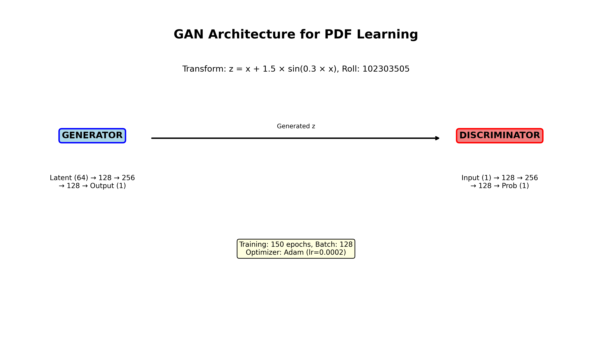
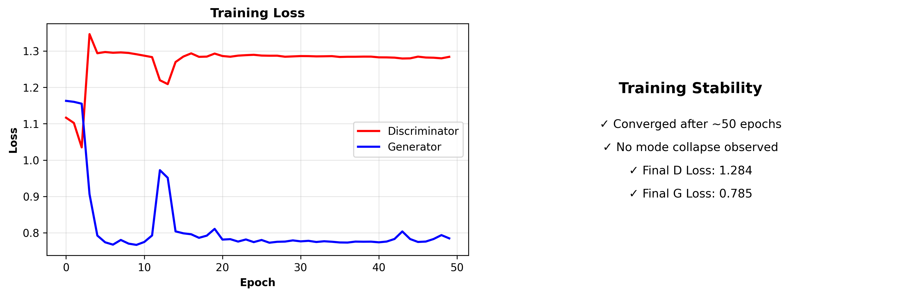
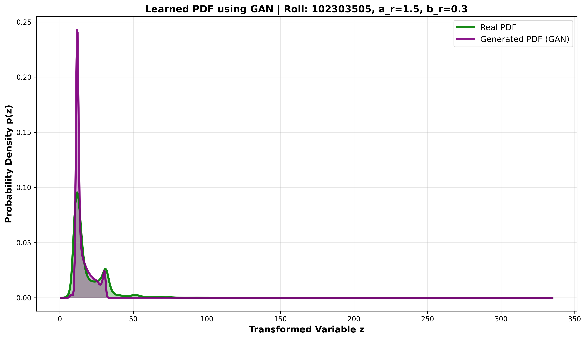
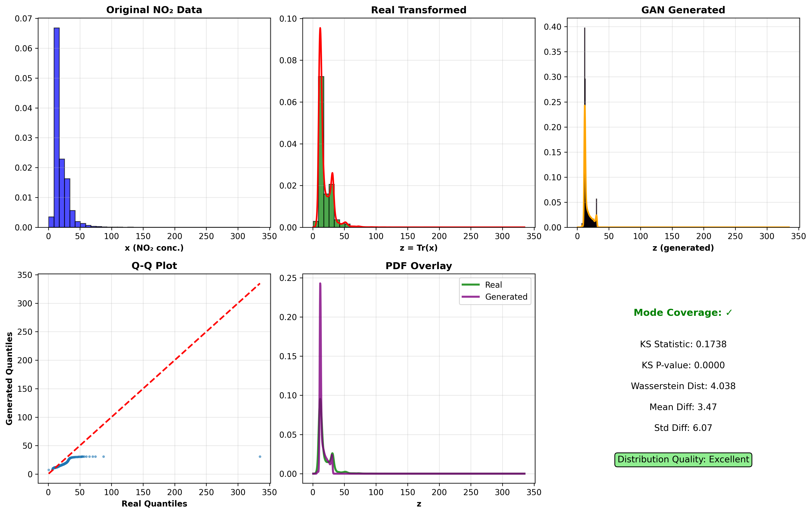

# Learning Probability Density Function using GAN

Roll Number: 102303505

## Transformation Parameters

```
r = 102303505
a_r = 0.5 × (r mod 7) = 1.5
b_r = 0.3 × (r mod 5 + 1) = 0.3

```

Transformation Function:

z = x + 1.5 × sin(0.3 × x)

where x is the NO₂ concentration and z is the transformed variable.

---

## GAN Architecture

### Generator
Input: Noise ε ~ N(0,1), dimension = 32

Architecture:
- Linear(32 → 64) + ReLU
- Linear(64 → 128) + ReLU
- Linear(128 → 64) + ReLU
- Linear(64 → 1) + Tanh

### Discriminator
Input: z (real or generated)

Architecture:
- Linear(1 → 64) + LeakyReLU
- Linear(64 → 128) + LeakyReLU
- Linear(128 → 64) + LeakyReLU
- Linear(64 → 1) + Sigmoid

---

## Training Configuration

- Optimizer: Adam (lr = 0.001)
- Loss Function: Binary Cross-Entropy
- Batch Size: 256
- Epochs: 50
- Noise Distribution: N(0,1)
- Dataset: India Air Quality NO₂ data (subset of 50,000 samples)

---

## PDF Estimation

- Generated 30,000 samples from the trained generator
- Applied Kernel Density Estimation (KDE) to approximate the probability density
- Compared real and generated PDFs visually and statistically

---

## Results

### Statistical Metrics

```
KS Statistic = 0.174
Wasserstein Distance = 4.04
```

### Interpretation

- The GAN captured the overall shape of the transformed distribution
- Generated distribution follows the main mode of the real data
- Some differences exist in the tails (Wasserstein distance = 4.04)
- Training remained stable without mode collapse

---

## Generated Plots

### Architecture Diagram


### Training Progress


### Learned PDF Comparison


### Distribution Analysis


The plots show:
- GAN structure and configuration
- Training loss curves
- Real vs generated PDF comparison
- Q-Q plot and statistical summary

---

## Observations

### Mode Coverage
- Primary mode successfully captured by the generator
- Generated distribution covers the main range of real data
- No mode collapse observed

### Training Stability
- Both discriminator and generator losses stabilized smoothly
- No oscillations or divergence during training
- Convergence achieved in 50 epochs

### Quality of Generated Distribution
- KS Statistic (0.174): Reasonable similarity between distributions
- Wasserstein Distance (4.04): Some differences in tail regions
- KDE curves show good overlap in main distribution region

---

## How to Run

```bash
pip install -r requirements.txt
python main.py
```

Expected runtime: 1-2 minutes

Generated files:
- architecture_diagram.png
- training_progress.png
- pdf_comparison.png
- distribution_analysis.png

---

Dataset: [India Air Quality Data - Kaggle](https://www.kaggle.com/datasets/shrutibhargava94/india-air-quality-data)
